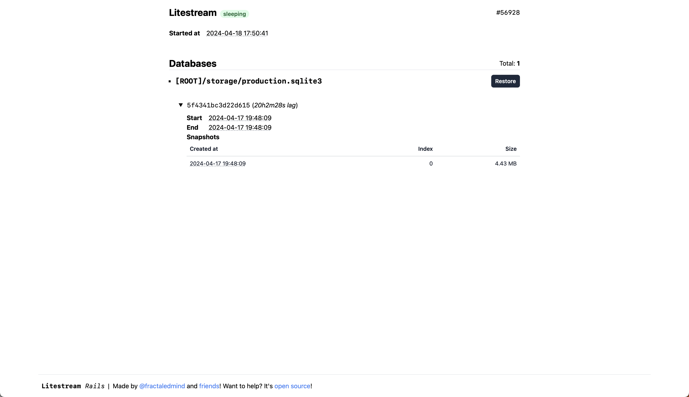

# Litestream Rails

<p>
  <a href="https://rubygems.org/gems/litestream_rails">
  
  </a>
  <a href="https://rubygems.org/gems/litestream_rails">
    
  </a>
  <a href="https://github.com/testdouble/standard">
    
  </a>
  <a href="https://github.com/fractaledmind/litestream_rails/actions/workflows/main.yml">
    
  </a>
  <a href="https://github.com/sponsors/fractaledmind">
    
  </a>
  <a href="https://ruby.social/@fractaledmind">
    
  </a>
  <a href="https://twitter.com/fractaledmind">
    
  </a>
</p>

Litestream Rails provides seamless integration of the [Litestream](https://litestream.io/) SQLite backup tool with your Rails applications. Built on top of the [Litestream Ruby](https://github.com/fractaledmind/litestream-ruby) gem, Litestream Rails allows you to configure, run, and monitor Litestream backups directly from your Rails application.

## Installation

Install the gem and add to the application's Gemfile by executing:
```bash
$ bundle add litestream_rails
```

If bundler is not being used to manage dependencies, install the gem by executing:
```bash
$ gem install litestream_rails
```

After installing the gem, run the installer:
```bash
$ rails generate litestream:install
```

The installer will create a configuration file at `config/litestream.yml`, an initializer file for configuring the gem at `config/initializers/litestream.rb`, as well as a `Procfile` so that you can run the Litestream replication process alongside your Rails application in production.

Then mount the engine in your `config/routes.rb` file:
```ruby
authenticate :user, -> (user) { user.admin? } do
  mount LitestreamRails::Engine, at: "/litestream_rails"
end
```

> [!NOTE]
> Be sure to [secure the dashboard](#authentication) in production.

## Usage

The [`litestream-ruby` gem](https://github.com/fractaledmind/litestream-ruby) wraps the standalone executable version of the [Litestream](https://litestream.io/install/source/) utility. These executables are platform specific, so there are actually separate underlying gems per platform, but the correct gem will automatically be picked for your platform. Litestream itself doesn't support Windows, so this gem doesn't either.

Supported platforms are:

* arm64-darwin (macos-arm64)
* x86_64-darwin (macos-x64)
* arm64-linux (linux-arm64)
* x86_64-linux (linux-x64)

This Rails engine intentionally provides only a few features. Since the Litestream utility only does one thing, and does it well, all this gem can do beyond the lower-level [`litestream-ruby` gem](https://github.com/fractaledmind/litestream-ruby) is to provide a web interface for introspecting Litestream's state and logs. The only action you can take from the dashboard is to restore a particular database from its Litestream backup.

There are, however, a few features I would like to add in the future:

- [ ] an ActiveJob for regularly verifying backups
- [ ] logs of the verification job runs in the web dashboard
- [ ] provide more information about the running Litestream replication process, like memory usage, CPU usage, etc.

### Configuration

You can configure Litestream Rails via the Rails configuration object, under the `litestream_rails` key. Currently, only 2 configuration options are available:

* `username` - The username to use for HTTP authentication. See [Authentication](#authentication) for more information.
* `password` - The password to use for HTTP authentication. See [Authentication](#authentication) for more information.

#### Authentication

Litestream Rails does not restrict access out of the box. You must secure the dashboard yourself. However, it does provide basic HTTP authentication that can be used with basic authentication or Devise. All you need to do is setup a username and password.

There are two ways to setup a username and password. First, you can use the `LITESTREAMRAILS_USERNAME` and `LITESTREAMRAILS_PASSWORD` environment variables:

```ruby
ENV["LITESTREAMRAILS_USERNAME"] = "frodo"
ENV["LITESTREAMRAILS_PASSWORD"] = "ikeptmysecrets"
```

Second, you can set the `LitestreamRails.username` and `LitestreamRails.password` variables in an initializer:

```ruby
# Set authentication credentials for Litestream Rails
config.litestream_rails.username = Rails.application.credentials.litestream_rails.username
config.litestream_rails.password = Rails.application.credentials.litestream_rails.password
```

Either way, if you have set a username and password, Litestream Rails will use basic HTTP authentication. If you have not set a username and password, Litestream Rails will not require any authentication to view the dashboard.

If you use Devise for authentication in your app, you can also restrict access to the dashboard by using their `authenticate` constraint in your routes file:

```ruby
authenticate :user, -> (user) { user.admin? } do
  mount LitestreamRails::Engine, at: "/litestream_rails"
end
```

### Examples

There is only one screen in the dashboard.

* the show view of the Litestream replication process:



### Usage with API-only Applications

If your Rails application is an API-only application (generated with the `rails new --api` command), you will need to add the following middleware to your `config/application.rb` file in order to use the dashboard UI provided by Litestream Rails:

```ruby
# /config/application.rb
config.middleware.use ActionDispatch::Cookies
config.middleware.use ActionDispatch::Session::CookieStore
config.middleware.use ActionDispatch::Flash
```

### Overwriting the views

You can find the views in [`app/views`](https://github.com/fractaledmind/litestream_rails/tree/main/app/views).

```bash
app/views/
├── layouts
│   └── litestream_rails
│       ├── _style.html
│       └── application.html.erb
└── litestream_rails
    └── processes
        └── show.html.erb

```

You can always take control of the views by creating your own views and/or partials at these paths in your application. For example, if you wanted to overwrite the application layout, you could create a file at `app/views/layouts/litestream_rails/application.html.erb`. If you wanted to remove the footer and the automatically disappearing flash messages, as one concrete example, you could define that file as:

```erb
<!DOCTYPE html>
<html>
  <head>
    <title>Litestream Rails</title>
    <%= csrf_meta_tags %>
    <%= csp_meta_tag %>

    <%= render "layouts/litestream_rails/style" %>
  </head>
  <body class="h-full flex flex-col">
    <main class="container mx-auto max-w-4xl mt-4 px-2 grow">
      <%= content_for?(:content) ? yield(:content) : yield %>
    </main>

    <div class="fixed top-0 left-0 right-0 text-center py-2">
      <% if notice.present? %>
        <p class="py-2 px-3 bg-green-50 text-green-500 font-medium rounded-lg inline-block">
          <%= notice %>
        </p>
      <% end %>

      <% if alert.present? %>
        <p class="py-2 px-3 bg-red-50 text-red-500 font-medium rounded-lg inline-block">
          <%= alert %>
        </p>
      <% end %>
    </div>
  </body>
</html>
```

## Development

After checking out the repo, run `bin/setup` to install dependencies. Then, run `rake test` to run the tests. You can also run `bin/console` for an interactive prompt that will allow you to experiment.

To install this gem onto your local machine, run `bundle exec rake install`. To release a new version, update the version number in `version.rb`, and then run `bundle exec rake release`, which will create a git tag for the version, push git commits and the created tag, and push the `.gem` file to [rubygems.org](https://rubygems.org).

## Contributing

Bug reports and pull requests are welcome on GitHub at https://github.com/fractaledmind/litestream_rails. This project is intended to be a safe, welcoming space for collaboration, and contributors are expected to adhere to the [code of conduct](https://github.com/fractaledmind/litestream_rails/blob/main/CODE_OF_CONDUCT.md).

## License

The gem is available as open source under the terms of the [MIT License](https://opensource.org/licenses/MIT).

## Code of Conduct

Everyone interacting in the LitestreamRails project's codebases, issue trackers, chat rooms and mailing lists is expected to follow the [code of conduct](https://github.com/fractaledmind/litestream_rails/blob/main/CODE_OF_CONDUCT.md).
